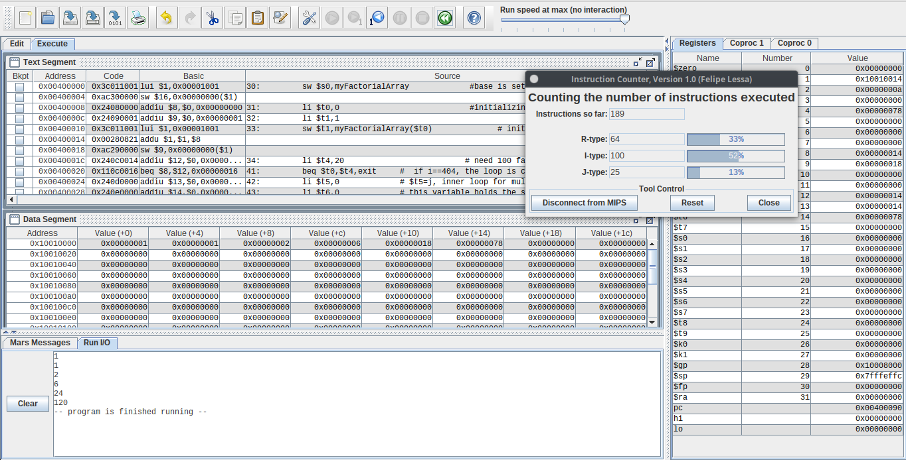
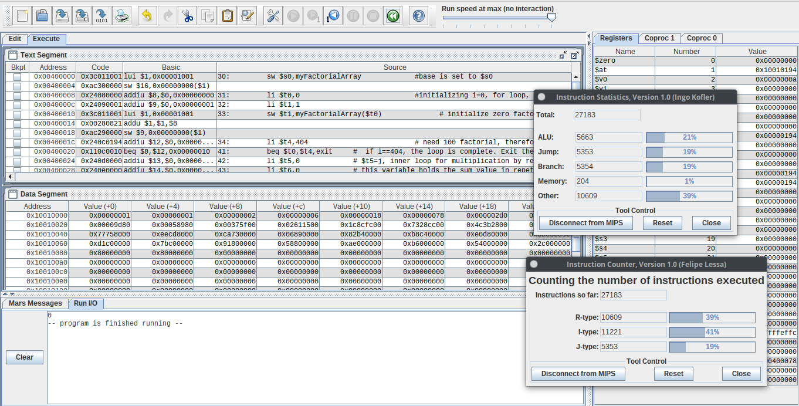
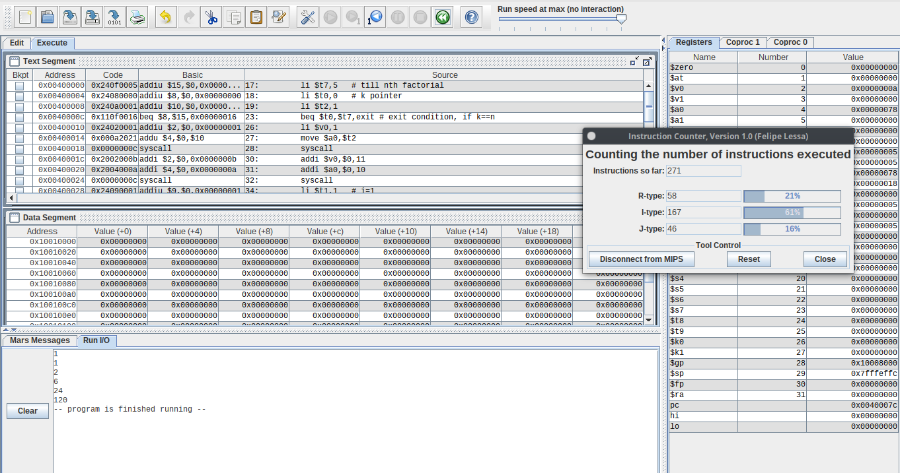
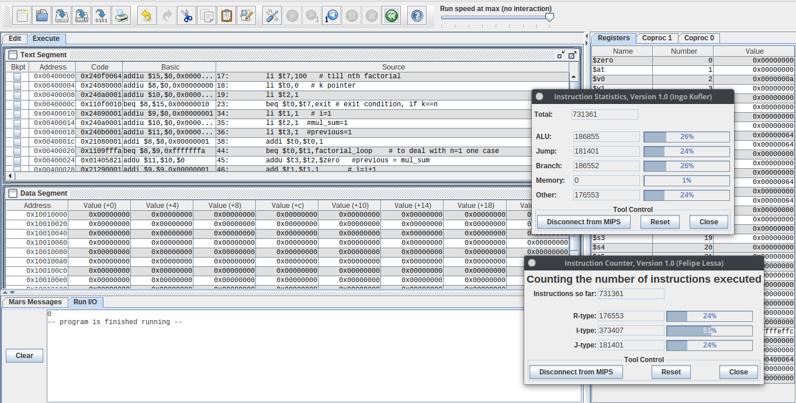

# 1711008 | Mohamed Shamir <!-- omit in toc -->

<span style="color:red">Note: Please visit the github repository for codes. [Link](https://github.com/mshamir11/computer-arch-assignments/tree/master/Assignment%202)</span>.

## Contents <!-- omit in toc -->
- [Problem 1](#problem-1)
    - [Solution](#solution)


<hr>

## Problem 1
Find the factorial of numbers 1 to 100 and store the result in myFactorialArray[] whose base
address is stored at $s0. Implement the program in MIPS assembly:   

  a. With Memoization //store the result and then retrieve for subsequent calculation

  b. Without Memoization //start afresh with the calculation.


<br> <!-- omit in toc -->
---

#### Solution

a. With Memoization:
- Psuedo Code
  
```python

myFactoryArray[101]
myFactoryArray[0]=1

for i in range(1,101):
  mul_sum=0
	for j in range(i):
		mul_sum+= myFactoryArray[i-1]	
  myFactoryArray[i]=mul_sum

```

- [MIPS Assembly Code](./_withMemo.s):

```mips
.data


myFactorialArray: .space 408         

.text

	sw $s0,myFactorialArray             #base is set to $s0
	li $t0,0                            #initializing i=0, for loop, here $t0=i
	li $t1,1
	sw $t1,myFactorialArray($t0)              # initialize zero factorial as 1
	li $t4,404                           # need 100 factorial, therefore, for i=0;i<101;i++, 
	li $t2,1                                         # Since integer cost 4bytes, we need the limit 101*4


loop:
	
	beq $t0,$t4,exit     #  if i==404, the loop is complete. Exit the program
	li $t5,0             # $t5=j, inner loop for multiplication by repetitive addtion,initialize j=0  
	li $t6,0             # this variable holds the sum value in repetitive addition. Let's call this variable, mul_sum
	lw $t1,myFactorialArray($t0)     # load the previously calculated factorial from the array into $t1
	
  # Uncomment the below six lines to print factorial of each kth value
	#li $v0,1                         
	#move $a0,$t1
	#syscall 
	
	#addi $v0,$0,11
	#addi $a0,$0,10
	#syscall
  
  j multiply                       # Go into the mulitplication loop. To calculate the current factorial
	
	

multiply:
	blt $t0,$t5,save_array    #branch out when $t0<$t5. We have to calculate, i*myArray[i-1]. This function adds i times
	                          # the previous array element. Once the multiplication is done. Go to the save array function.
	addu $t6,$t6,$t1          # add the previous element to the mul_sum, mul_sum += myArray[i-1]     
	addi $t5,$t5,4            # j+=4, since the array indices are multiples of 4. (4 bytes for integers)
	j multiply


save_array:
	addi $t0,$t0,4      # i = i+4 
	sw $t6,myFactorialArray($t0)      # the mul_sum is copied to the myArraySum[i]
	j loop                            # it goes back to the loop.
	 
exit:
	li $v0,1                         
	move $a0,$t6
	syscall                           # Syntax for print services  for integers
	
	li $v0,10                        # Exit
	syscall
```

- Output for first 5 numbers.
  


- Instruction Count for calculating 1 to 100 factorials:
  


<br> <!-- omit in toc -->
---

b. Without Memoization:

- Psuedo Code:
  
```python
for k in range(1,n+1):               
  prev=1

  for i in range(1,k+1):
    mul_sum=0
    
    for j in range(i):
      mul_sum+=prev
    prev=mul_sum
  
  print("kth factorial",mul_sum)
```


- [Assembly Code](./_withoutMemo.s)

```mips
.text
	li $t7,100   # till nth factorial
	li $t0,0   # k pointer
	li $t2,1

factorial_loop:
	
	beq $t0,$t7,exit # exit condition, if k==n
	
	# Uncomment the below six lines to print factorial of each kth value
	#li $v0,1
	#move $a0,$t2
	#syscall
	
	#addi $v0,$0,11
	#addi $a0,$0,10
	#syscall
	
	li $t1,1   # i=1
	li $t2,1  #mul_sum=1
	li $t3,1  #previous=1
#li $t4,1  #current =1
	addi $t0,$t0,1
	
	
	
loop:
	
	beq $t0,$t1,factorial_loop    # to deal with n=1 one case 
	addu $t3,$t2,$zero   #previous = mul_sum
	add $t1,$t1,1       # i=i+1
	li $t2,0            # reset mul_sum=0
	li $t5,0            # j pointer 
	j multiply
	

multiply:
	beq $t5,$t1,validate_loop    # if j==i,exit multiplication.and go to validate_loop
	addu $t2,$t2,$t3             # Add mul_sum += previous
	addi $t5,$t5,1               # j+=1
	j multiply

validate_loop:
	
	beq $t1,$t0,factorial_loop   # if i==k,we have successfully calculated the factorial for the integer with value k
				     # we will go to factorial_loop again to find the factorial for k+1 th integer
	j loop
	
	
exit:
	li $v0,1
	move $a0,$t2     # print the factorial of the last element to check  things are working fine   
	syscall
	
	li $v0,10
	syscall

```

- Output for first 5 numbers:
  


- Instruction Count for calculating 1 to 100 factorials:




- **Remarks** 🌟⭐:
  
  -  The Experment need not to be done multiple time since, the instruction count does not change unless some changes are made in the code. (it was tried multiple times and verified that it does not change.)
  
  - "addu" (add unsigned integer) was used while adding the factorials as "add" command is for signed integers and was getting an overflow error since it the factorial value exceeds the maximul limit of it.
  - The following instruction counts were obtained:
    - With Memoization: 27,183    

    - Without Memoization: 7,31,381
  - Without Memoization has almost **27 times** more instruction count than with memoization as expected. Since, in without memoization, we had repeated many factorial calculations while in memoization, we had used values stored in the myFactorialArray.
  - This can also be considered as a justification why with memoization is more faster than without memoization.
  - If we check the instruction statistics of both the experiments. We can see that the memory usage in with memoization is more than without memoization as expected since we are using arrays to store the factorial values. The advantage in the time complexity of with memoization comes with a tradeoff with space.